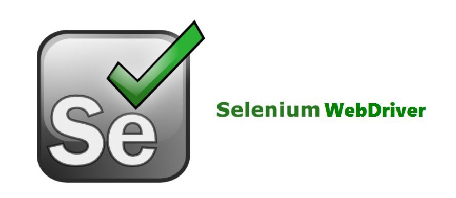

# Quote Scraper Selenium




## Table of Contents
- [Introduction](#introduction)
- [Features](#features)
- [Screenshots](#screenshots)
- [Launch](#launch)
- [Technologies](#technologies)

## Introduction
Quote Scraper Selenium is a python application that scrapes the quote catalogue website, http://quotes.toscrape.com/search.aspx. It uses [Selenium](https://selenium-python.readthedocs.io)_ and the [Chrome Web Driver](https://chromedriver.chromium.org/downloads) to search the website for quotes by author and tag.

The purpose of this application was to become more familiar with browser automation with Selenium.

## Features
- Scrapes the web site: http://quotes.toscrape.com/search.aspx
- Console menu with the options:
    - "Enter the author you'd like quotes from"
    - "Enter your tag"
- Uses Selenium, Chrome Web Driver, and user input to find a quote by an author that also matches a tag.
- Uses implicit waiting to wait for Browser JavaScript to run quote search.

## Screenshots
### Screenshot of Console Menu


### Screenshot of Search Page Before Console Input


### Screenshot of Search Page After Console Input


## Launch
To run, in the console enter:
```
python app.py
```

## Technologies
- [Python 3.8.3](https://www.python.org/downloads/release/python-383/)
### Python Modules
- [Selenium](https://pypi.org/project/selenium/)
    - Allows automation of web browser interaction from Python.
